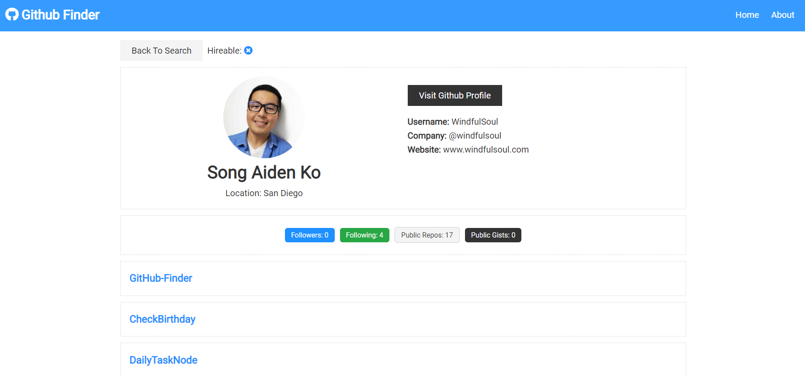

This is an extensive React project that maximizes the frontend capabilities of optimized Javascript Library and incorporates the power of components. The application allows the users to search for accounts in Github through receiving API data, and it showcases the history and repositories of the account correspondigly. Through this project, I was able to understand how components worked best through an organized structure and utilities of React Hooks such as useState, useEffect, useContext along with React Reducer. 

One of the most important learning aspects of this project was to call for API data from GitHub and how to display information up on screen. It was an intensive 4-week project on React, and I learned so much about how React is used on frontend. 

# Github Finder

## Usage

### `npm install`

### `npm start`

Runs the app in the development mode. 
Open [http://localhost:3000](http://localhost:3000)

### `npm run build`

Builds the app for production to the `build` folder. 
